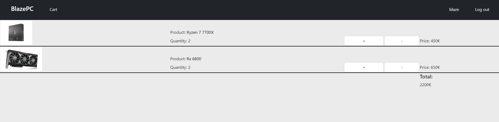

<!--

Writing Guidelines
https://docs.github.com/en/get-started/writing-on-github/getting-started-with-writing-and-formatting-on-github/basic-writing-and-formatting-syntax

“The code is more what you’d call ‘guidelines’ than actual rules.”
– Barbossa, Pirates of the Caribbean

-->

# BlazePC
#### Video Demo:  <https://youtu.be/1t9iRVkhzps>
#### Description:

>"All that we ask is that you build something of interest to you, that you solve an actual problem, that you impact your community, or that you change the world. Strive to create something that outlives this course."

What will your software do? What features will it have? How will it be executed?

    To build upon the last 2 weeks of CS50, I decided to make a website  for a hypothetical PC hardware store, aptly named BlazePC, no coincidence to my username "BlazeDator".
    I'll be using Python with the Flask framework, for the backend, and HTML/CSS/Javascript for the front-end, and cs50s sql library. I'll probably use some of the distribution code given for Finance, like the login required function, the usd function but for euros instead.

    The Features:
        - A layout.html with a navbar for the different parts of the store, like components, shopping cart, account, a special place for administrators to manage the store
        - Code/Design the components pages
        - Code/Design the accounts pages
        - Code/Design the shopping cart
        - Code/Design the administration section

    This are the basic features I intend to have, but I also wanted to design a PC configurator, as a simple tool that will help people spec out a fully working computer.

What new skills will you need to acquire? What topics will you need to research?

    I need to develop the skills used for the Homepage and Finance problems sets even further, and build a hypothetical fully working PC hardware store.

In the world of software, most everything takes longer to implement than you expect. And so it’s not uncommon to accomplish less in a fixed amount of time than you hope. What might you consider to be a good outcome for your project? A better outcome? The best outcome?

    A good outcome is having all the features that I listed before.

    A better outcome is having the configurator

    A best outcome is having a professional looking PC store, that couldn't be easily dismissed as a project at first look, and maybe even at a second look

Consider making goal milestones to keep you on track.

    Timetable:

        Set up Python/Flask
        Create the needed content for layout.html, navbar and footer
        Create script for dinamically select which page I am in navbar, could reuse one I did for Homepage
        Create a database for components to sell
        Create a page for showing the components
        Create or copy and give credit, the usd function from Finance for euros, maybe even display based on the user's current location if available
        Create a table for users, and shopping cart
        Create register and login functionality to create accounts
        Create a shopping cart to track each user's potential buys
        Copy and give credit for the login required function of Finance or learn to do it and create something similar
        Create an administration page
        Create a configurator page and delineates the steps to speccing out a fully working computer

Design Notes:

    On the Components page,

        After creating sections and sub sections of components, one obligatory thing to add is filters

    On the Administration page, design debate

        Instead of using an admin page, I could create a separate web application for managing the db, ensuring the website has no connection to the administration. Could also have a table that defines the admins users, and have it only be modified by terminal commands, and no code in the store page touches it, so unless I'm vulnerable to injection attacks or someone gets physical access to my server, no one could theoretically access it, if I block access to non admin users.

        Current consensus, nothing beats editing a website and seeing results a refresh away, having two separate apps, would increase security but also reduce workflow

28/09/2022

    Designed the start of the readme file, had some trouble as codespaces were down. Writing the start of the flask app, hello world should suffice for today, maybe creating a bit of the layout.html

29/09/2022

    Designing the database for the store, trying to understand what I'm gonna need to have for a complete store:

    An users table,
    An officers table for knowing who the admins are,
    An items table that has space for categories and specs which will be written from other tables info, also has a key from brands,
    A brands table ,
    An images table that has an items key,

    I also made a diagram:

    Blue boxes -> Tables
    Yellow Arrows -> Scripts/Magic
    Green Cylinders -> Back-End
    Theather Boxes -> Pages
    ChatBoxes -> Interaction/Users

Used this website
>https://app.diagrams.net/

30/09/2022

    Today I implemented the register, login, logout backend routes(Heavily based on my code from my problem set 9). Since I still don't know how to test the backend without a front-end, I designed a bit of the pages needed to register, login, and made the login/logout button, and register/account name dynamic on the layout.html.

    I copied the login required function from the problem set 9, and used that function to create a new one, to block certain routes from already logged in users. So a logged in user, can't go to login page and register page, unless they log out and then go there.

02/10/2022

    Today I had a lot of problems, I was trying to make my office page all dynamic, and even went back on  the separation of files I had tried.
    At the end I played with the get and post routes to make one route make more then one thing, and this was  the current "backoffice" state at the end of today.

    I can add, remove Brands, Categories and Specs.

    Items isn't working yet but when I select a category, add or delete a spec, the page reloads and selects the correct specs for the current category of items

04/10/2022

    Today I implemented the needed logic to insert items into the db from the form in the backoffice. I'm gonna be storing the specs as a single text value on the table but separating them with commas, for easy reading later, when displaying such items in the store.

05/10/2022

    Added a new page to add images and process their names and extensions, it's heavily based on the flask documentation, which I have linked in the start of the app route.

    Every image will be added with product id + dash + img + number out of 3 + . + extension already used.

    Images were taken from newegg, amd's website and amazon.

    Now, I'll have to coordinate all this information I've gathered, into useful display on the /items page which I just made list every item, to see which ones I had.

08/10/2022

    Made the store page display the items with the first image associated, using the bootstrap card code.

    The culmination of my work so far, displaying store items

10/10/2022

    Added a cart page, copied the code from the flask lesson, source:
> https://cs50.harvard.edu/x/2022/notes/9/#store-shows

    Added a basic way to count, it's really bad designed as it loops over all the items in cart, instead of just counting each unique. Need to research how to do that, for now here it is.

11/10/2022

    After researching various topics about having unique values, I found out more about sets in python, which have only unique values, so I'm gonna create a set out of the values saved in the cart, and then iterate each from the set and count the ones on the session cart.

    Made images appear next to items in the cart for easier reading, started work on the individual item pages.

    Made a way to process the way I wrote the specs into the db as a dict.

12/10/2022

    Moved the specs processer into a separate function on the helpers, coulda probably used JSON object or researched more on how to store a dict. But since it's working now, kinda of pointless to fix for this small project, but definitely would research more into storing a dict next time.

    Now whenever I need the specs in a dict usable format, just need to call the function.

15/10/2022

    Worked on the css and style of the backoffice. Results:

    When reworking the images part of the backoffice, I needed to find a way to hide when images dont exist yet, which I would also use in the store part of the website

    Code origin of the image not displaying
>https://stackoverflow.com/questions/22051573/how-to-hide-image-broken-icon-using-only-css-html

    Results of image backoffice:

    New item delete page, very simple, need to use ctrl-f if the dataset got big enough, might develop it further but for now it works, it deletes the item entry on the db and also the images associated with, if they exist.

16/10/2022

    Reworked the cart page and the navbar.

    Reworked the item page when a specific item is clicked on the store or the cart

    Reworked Login and register appearance as well

Update to objectives:

    Well today's been around 19 days since I started building this project, there's been a lot of days that I couldn't find the time/patience/ambition to work on it when coming from work. I'd like to remove some of the planned features, and just focus on what would make it feel like a complete store, I came up with these 3 things

        - Create a stock and price manager for the backoffice
        - Make add to cart not work if stock is zero for the store part, item specific page and quantity change on the cart
        - Create something on accounts page, this one is a surprise
        - Add more comments, ahm, maybe

    After this I think it will feel like a complete project, albeit smaller.

    The price/stock simple manager front-end, now need to process the information.

    After making the backend for changing stock and price numbers, I did the add to cart on the store tell me if it's out of stock.

19/10/2022

    Today I worked on adding a search bar, I was having some issues where the flask server would throw errors related to cookies. So I made the search require the Enter key, unless it's empty which will clear it. I also made the firstRender which will populate the page, when the user lands on it.

20/10/2022

    Recorded the video showing the project, and I feel like it's done. It was quite the journey from week 0 in scratch to here, I'm hoping I'll complete other cs50's courses, because I really liked the way it was taught.

    Thank you to the CS50's team and Professor David J. Malan.